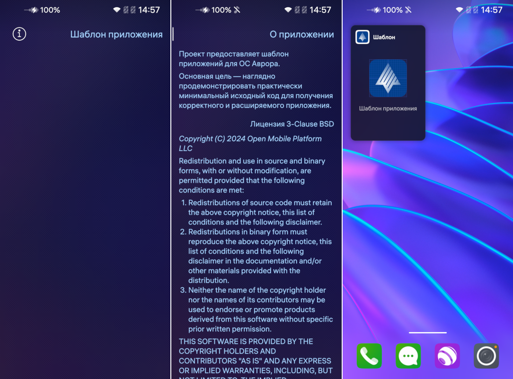

# Шаблон приложения

Проект предоставляет шаблон для приложений Aurora OS.

Основная цель — наглядно продемонстрировать практически минимальный исходный код для получения корректного и расширяемого приложения.  
**Для сборки через ASBT возможно потребуется ручная установка cmake и ninja пакетов.  Также нужно дождаться фикса, чтобы работала утилита lupdate для переводов из кросскомпилятора.**

Статус сборки:
1. example - 
2. dev - 

## Условия использования и участия

Исходный код проекта предоставляется по [лицензии](LICENSE.BSD-3-Clause.md),
которая позволяет использовать его в сторонних приложениях.

[Соглашение участника](CONTRIBUTING.md) регламентирует права,
предоставляемые участниками компании «Открытая Мобильная Платформа».

Информация об участниках указана в файле [AUTHORS](AUTHORS.md).

[Кодекс поведения](CODE_OF_CONDUCT.md) — это действующий набор правил
компании «Открытая Мобильная Платформа»,
который информирует об ожиданиях по взаимодействию между членами сообщества при общении и работе над проектами.

## Структура проекта

Проект имеет стандартную структуру приложения на базе C++ и QML для ОС Аврора.

* Файл **[CMakeLists.txt](CMakeLists.txt)** описывает структуру проекта для системы сборки cmake.
* Каталог **[icons](icons)** содержит иконки приложения для поддерживаемых разрешений экрана.
* Каталог **[qml](qml)** содержит исходный код на QML и ресурсы интерфейса пользователя.
  * Каталог **[cover](qml/cover)** содержит реализации обложек приложения.
  * Каталог **[icons](qml/icons)** содержит дополнительные иконки интерфейса пользователя.
  * Каталог **[pages](qml/pages)** содержит страницы приложения.
  * Файл **[KotGym.qml](qml/KotGym.qml)** предоставляет реализацию окна приложения.
* Каталог **[rpm](rpm)** содержит настройки сборки rpm-пакета.
  * Файл **[ru.kotdath.KotGym.spec](rpm/ru.kotdath.KotGym.spec)** используется инструментом rpmbuild.
* Каталог **[src](src)** содержит исходный код на C++.
  * Файл **[main.cpp](src/main.cpp)** является точкой входа в приложение.
* Каталог **[translations](translations)** содержит файлы перевода интерфейса пользователя.
* Файл **[ru.kotdath.KotGym.desktop](ru.kotdath.KotGym.desktop)** определяет отображение и параметры запуска приложения.

## Совместимость

Проект совместим с актуальными версиями ОС Аврора.

## Снимки экранов

## This document in English

- [README.md](README.md)
